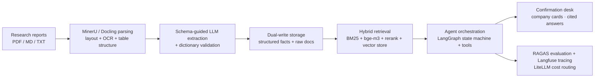

# Quantra

**Agentic research intelligence platform for equity research reports.**


Quantra turns raw research reports (PDF/MD/TXT) into a queryable, traceable knowledge base:
multi-format parsing → schema-guided LLM extraction → dual-write storage (structured facts + raw documents)
→ agentic Q&A with citation-level traceability → human-in-the-loop confirmation that feeds a
cross-conversation memory layer.

> Industry practice project. Not investment advice.

## Highlights

- **Parse everything**: MinerU / Docling pipeline for complex layouts, tables, and scanned pages;
  lightweight text parser as fallback.
- **Extract with schema discipline**: schema-guided LLM extraction validated by a 96-metric,
  10-industry dictionary — numbers stay reproducible and auditable.
- **Dual-write knowledge base**: structured fact tables (company-anchored, composite keys for
  `report × company × metric × period`) for BI and precise queries, plus raw-document layer
  (multimodal/object storage) for provenance and full-text reading.
- **SQL-first, RAG-fallback routing**: rule-based router classifies intent, queries structured facts
  first, and automatically falls back to hybrid retrieval on coverage gaps.
- **Human-in-the-loop confirmation**: every answer can be confirmed or corrected; confirmations become
  durable memory (facts / conclusions / corrections / preferences) injected into future sessions.
- **Production observability & evaluation**: RAGAS-grounded citation coverage, audit trail, and
  Langfuse-ready tracing.

## Architecture



## Tech Stack

| Layer | Choice | Notes |
|---|---|---|
| Parsing | MinerU / Docling | CNN layout detection + OCR; fallback: pdfplumber |
| Extraction | Schema-guided LLM + rule validation | OpenAI-compatible providers |
| Storage | SQLite/Postgres + Qdrant/pgvector | fact tables + vector index |
| Retrieval | bge-m3 + BM25 + bge-reranker | hybrid, precision-first |
| Orchestration | LangGraph + MCP-style tools | state machine + human approval |
| Model routing | LiteLLM | cost-aware routing |
| Evaluation | RAGAS + citation grounding | hallucination guard |
| Observability | Langfuse | self-hosted, traces + cost |

## Quick Start

```bash
git clone https://github.com/PAUL01zjb/quantra.git
cd quantra
./install.sh            # virtualenv + dependencies + configuration wizard
quantra ui              # launch the web console
```

`install.sh` installs the full production extras (`pip install -e ".[production]"`) and runs
`quantra setup`, a configuration wizard that wires model providers (LLM, embeddings), vector store,
parser engine, and observability. Secrets are written only to the local `.env` (mode 0600) and never
committed.

Without any provider keys, the system runs in deterministic mode so the whole pipeline remains
exercisable; add keys in `.env` (or re-run `quantra setup`) to enable LLM extraction, embeddings,
and LangGraph orchestration.

### CLI

```bash
quantra setup                          # configuration wizard
quantra ingest-doc <report>            # ingest pipeline: parse → extract → tag → dual-write
quantra ask "What was CMB's 2025 NIM?" # routed Q&A (SQL-first, doc fallback)
quantra confirm "..."                  # confirmation → durable memory
quantra correct "..." "..."            # correction memory
quantra memories [keyword]             # list/search cross-conversation memory
quantra verify                         # end-to-end verification suite
quantra ui --port 8000                 # web console
```

## Project Structure

```
quantra/
├── parsing/          ParseRequest → engine layer (MinerU/Docling/pdfplumber) → ParseResult
├── extraction/       ParseResult → ExtractionResult (industry dictionary + LLM channel)
├── storage/          schema v2: company/report/metric_fact/chunk/risk + raw_doc + memory
├── retrieval/        chunking, BM25, hybrid (vector store + rerank providers)
├── query/            routing: rule intent → dual channel → coverage fallback
├── memory/           confirmation-driven memory: facts/conclusions/corrections/preferences
├── ingestion/        pipeline: parse → extract → tag → dual-write
├── agent/            tools, audit, Plan-and-Execute + LangGraph wiring
├── providers/        LLM / embeddings / vector store / reranker / observability
├── eval/             citation coverage, hallucination guard
├── verification/     golden-standard end-to-end verification
└── app/              CLI + zero-dependency web console
```

## Roadmap

- [x] Parsing layer with MinerU integration
- [x] Extraction: 96-metric / 10-industry dictionary + LLM channel
- [x] Archive layer (company-anchored composite facts) + company cards
- [x] Ingestion pipeline with auto-tagging and dual-write
- [x] Routed Q&A (SQL-first / RAG-fallback)
- [x] Cross-conversation memory (confirmation-driven)
- [x] Zero-dependency web console + packaging
- [ ] Embeddings + vector store + rerank fully wired (providers ready)
- [ ] LangGraph orchestration enabled (graph module ready)
- [ ] RAGAS golden-regression suite
- [ ] Open-source contribution (TencentDB-Agent-Memory / skills pack)

## License

MIT
