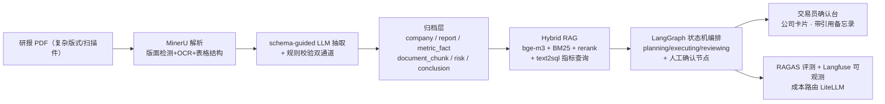

# Quantra —— Agentic 研报投研工作台（生产版）

> 目标：辅助交易员**快速确认研报信息**——多格式研报 → 结构化抽取 → 归档建库 → 业务问答/数据分析，全程**引用可溯源、动作可审计、成本可计算**。
>
> 本仓库展示的是**完整生产架构**（大引擎版本）；仓库内同时保留零重型依赖的本地学习版实现，用于开发调试。

## 生产架构（本仓库展示的主版本）



### 技术选型（行业主流/前沿）

| 环节 | 选型 | 说明 |
|---|---|---|
| 文档解析 | **MinerU** / Docling | CNN 版面检测 + OCR + 表格/公式模型，复杂版式首选 |
| 结构化抽取 | **schema-guided LLM + 规则校验** | LLM 按输出契约抽取，规则引擎交叉验证，数字可复现 |
| 存储归档 | SQLite/Postgres + Qdrant/pgvector | 指标事实表（复合键）+ 向量库分离 |
| 检索 | bge-m3 + BM25 + bge-reranker | 金融数字场景先保精确召回，再语义补充 |
| Agent 编排 | **LangGraph** + MCP 工具标准 | 状态机 + 人机审批 + 持久化，生产级主流 |
| 模型路由 | LiteLLM | 批量走便宜模型、复杂推理走旗舰，成本账可算 |
| 评测 | RAGAS + 自建引用硬规则 | 引用覆盖率、幻觉守卫、金标准回归 |
| 可观测 | Langfuse（自托管） | trace + 成本 + 评测，数据不出网 |

## 数据模型（输出契约）

**公司主维度 + 指标事实复合键**（已确认方案）：

| 表 | 主键 | 说明 |
|---|---|---|
| `company` | company_id（**ticker 优先**，如 600036.SH）| 主维度 |
| `report` | report_id | 研报档案（机构/分析师/评级/目标价）|
| `metric_fact` | (report_id, company_id, metric_name, period) | 指标事实 |
| `document_chunk` | chunk_id | 原文块（引用溯源）|
| `risk` / `conclusion` | — | 风险提示 / 关键结论 |
| `extraction_audit` | — | 抽取审计 |

指标词典覆盖 **10 个行业**（通用财务/银行/证券/保险/地产/消费/医药/科技制造/汽车/能源化工/公用基建），约 90 项规范指标，别名自动归一化。

## 本地学习版（零重型依赖，当前仓库可运行）

本地开发用轻量实现跑通同一条链路：pdfplumber 解析（文本型 PDF）→ 规则抽取 → 归档 → 公司卡片 → 端到端验证。生产组件（MinerU、LLM 抽取、LangGraph）在仓库已预留接口，部署时启用，输出契约不变。

```bash
cd quantra
python -m quantra.app.cli init-db
python -m quantra.app.cli parse data/samples/示例-消费龙头2025年报点评.pdf --out /tmp/out.md
python -m quantra.app.cli extract data/samples/示例-消费龙头2025年报点评.pdf
python -m quantra.app.cli verify                       # 端到端验证（输入识别→输出合理性→数据库沉淀）
python -m quantra.app.cli scenario run analyst-compare # 业务场景模拟
python -m quantra.app.cli audit-log --limit 20
```

启用生产引擎（部署时）：

```bash
pip install "magic-pdf[full]"
python -m quantra.app.cli parse 研报.pdf --engine mineru --out /tmp/out.md
```

## 模块结构

```
quantra/
├── parsing/          解析小框架：ParseRequest → 引擎层（pdfplumber/MinerU/Docling）→ ParseResult
├── extraction/       抽取层：ParseResult → ExtractionResult（指标词典/规则抽取，LLM 通道预留）
├── storage/          归档层：schema v2（company/report/metric_fact/...）+ 公司卡片聚合
├── retrieval/        检索层：分块 + BM25 + 混合检索（向量接口预留）
├── agent/            编排层：工具/路由/审计 + Plan-and-Execute（LangGraph 迁移预留）
├── eval/             评测层：引用覆盖率、幻觉守卫
├── scenarios/        业务场景模拟器（基金经理助理 / 风控评审）
├── verification/     端到端验证器（金标准比对 + 报告）
└── app/cli.py        命令行入口
```

## Roadmap

- [x] M0 立项与架构（生产版 + 本地学习版双轨）
- [x] M1 解析层接口化 + MinerU 引擎集成
- [x] M1 归档层（company 主维度 + metric_fact 复合键 + 行业指标词典）
- [x] M1 端到端验证（35/35 通过，真实研报发现已记录）
- [ ] M2 检索与记忆（hybrid RAG + 会话记忆）
- [ ] M3 Agent 编排升级 LangGraph（状态机 + 人工确认）
- [ ] M4 评测与打磨（RAGAS + 金标准回归）
- [ ] M5 开源贡献（TencentDB-Agent-Memory / 技能包 PR）

> 免责声明：本项目仅用于学习与研究，不构成任何投资建议。
