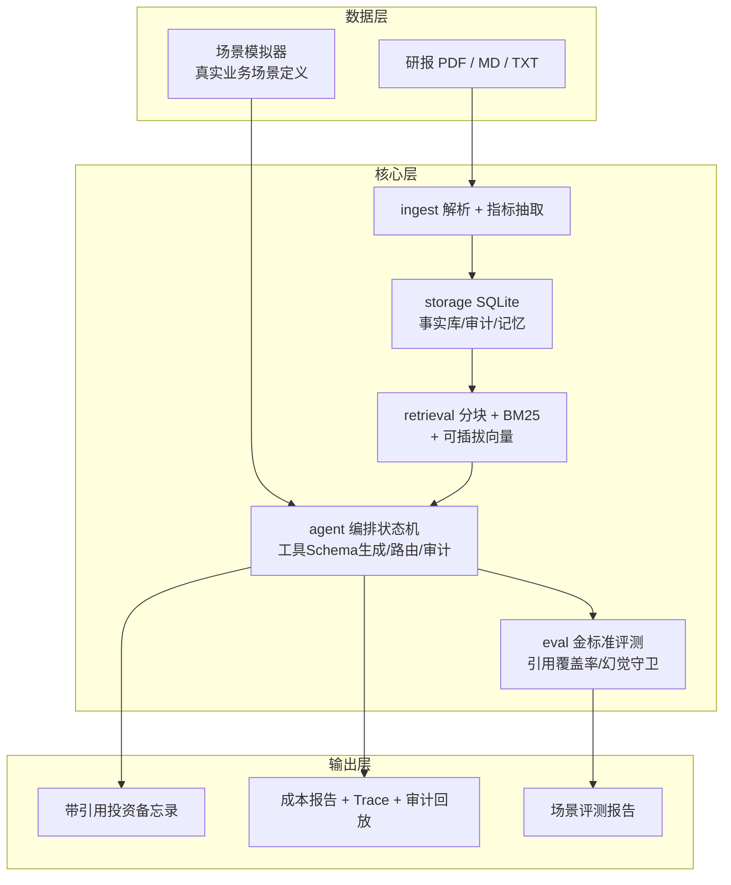
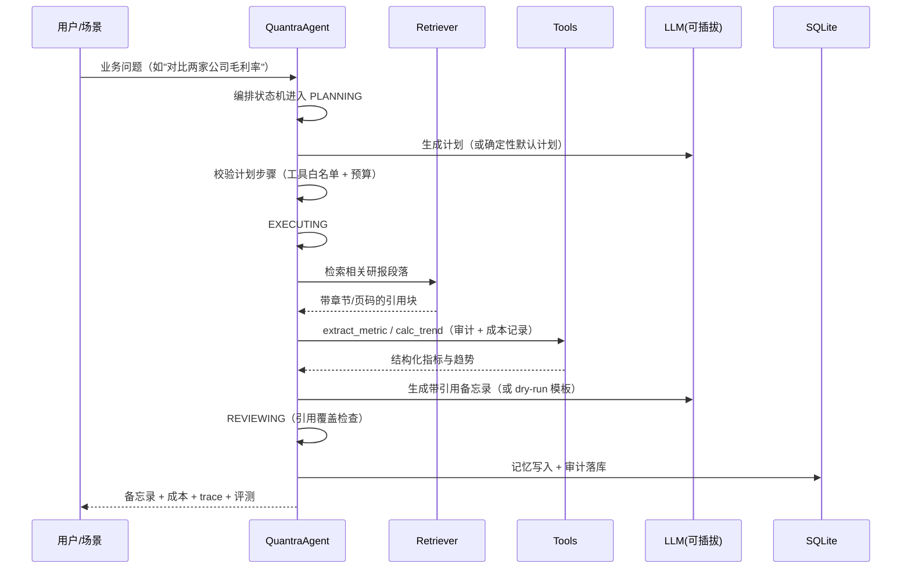
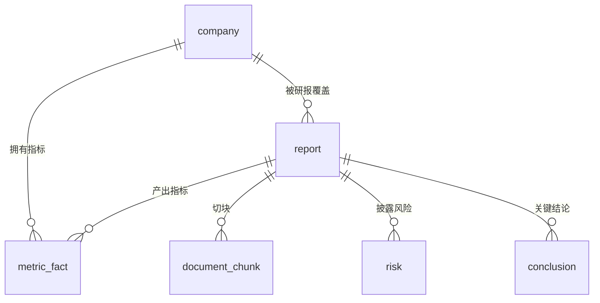

# Quantra 架构设计（v0.1）

> 更新：2026-08-08 ｜ 状态：与代码同步演进

## 1. 总体架构

## 2. 一次业务问答的完整时序

## 3. 模块职责与接口

| 模块 | 职责 | 关键接口 |
|---|---|---|
| `parsing/` | 解析小框架：输入接口 ParseRequest → 引擎层（pdfplumber/MinerU/Docling 插拔）→ 输出接口 ParseResult | `parse_document(request) -> ParseResult` |
| `ingest/parser` | （旧版，待迁移）解析 + 规则抽取指标 | `parse_document(path) -> Report` |
| `storage/db` | 事实库、审计、记忆统一落库 | `upsert_report / audit / memory_append` |
| `retrieval/chunking` | 标题感知分块、表格保留、重叠窗口 | `chunk_report(report) -> list[Chunk]` |
| `retrieval/bm25` | 手写 BM25（含中文分词兜底） | `fit(docs) / top_k(query)` |
| `retrieval/hybrid` | BM25 + 可插拔向量 + RRF | `search(query, k) -> list[RetrievedChunk]` |
| `agent/tools` | 工具注册、Schema 生成、白名单 | `run_tool(name, args)` |
| `agent/orchestrator` | 三态状态机、计划-执行-评审 | `run(question) -> AgentResult` |
| `agent/router` | 成本感知模型路由 | `route(task, settings) -> model` |
| `agent/audit` | 全链路审计钩子 | `step(action, detail)` 上下文管理器 |
| `eval/grounding` | 引用覆盖率、幻觉守卫 | `citation_coverage(memo, evidence)` |
| `scenarios/` | 真实业务场景定义与模拟运行 | `run_scenario(id) -> report` |
| `app/cli` | 命令行入口 | `ingest / query / scenario / eval / audit-log` |

## 4. 关键设计决策（trade-off）

### 4.1 编排 = 状态机，不是"死循环调模型"

决策：planning → executing → reviewing 三态显式建模；步数上限、成本预算上限、失败重试与回退。

为什么：裸 ReAct 循环的最大问题是"不收敛不可控"。显式状态机让"Agent 卡死/超支"从玄学变成可设计、可测试、可面试讲解的工程问题。

代价：编排灵活性略降（每类任务需要适配计划模板），通过"确定性默认计划 + LLM 计划双通道"缓解。

### 4.2 工具 Schema 从函数签名自动生成

决策：用 `inspect.signature` + 类型注解 + docstring 第一行生成 JSON Schema，执行前参数校验、执行后异常恢复。

为什么：手写 Schema 会与函数实现漂移；自动生成保证"工具定义"与"工具实现"单一事实源。这也是函数调用底层的核心工程点。

代价：类型注解需要规范（`Optional[str]`、默认值语义需约定），用测试锁定。

### 4.6 解析层 = 接口化流水线，不是"一个解析函数"

决策：`ParseRequest`（输入契约：来源/语言/模式/是否解析表格/页范围/引擎）→ 引擎层（pdfplumber 默认、MinerU/Docling 可选）→ `ParseResult`（输出契约：blocks/markdown/stats/engine）。

为什么：解析方案演进快（CNN 版面检测 → VLM 端到端），接口隔离后换引擎不影响上层；上层（抽取/归档/Agent）只依赖输出契约，可测试、可审计。

代价：多一层抽象；用引擎选择策略（auto → 文本型用 pdfplumber，扫描件切 MinerU）缓解。

### 4.3 检索 = BM25 起步，向量可插拔

决策：手写 BM25（含中文 unigram+bigram 兜底），向量检索通过 `Embedder` 接口预留，RRF 融合。

为什么：金融数字场景大量精确匹配（指标名、年份、数值），BM25 是性价比最高的基线；先跑通再上向量，避免过早引入依赖。

代价：语义召回弱于向量检索，D3 以 recall@k 金标准集评估差距后决定是否接入。

### 4.4 记忆 = 分层设计

决策：episodic（问答记录）+ semantic（研究结论/待验证假设/失败经验）分层，跨会话可查、可去重。

为什么：对齐 8/3 简报"记忆层卡位"主题；研究结论不丢、失败经验可复用，是量化研究 Agent 的核心痛点。

### 4.5 评测 = 引用覆盖率 + 金标准回归

决策：每个结论句必须与证据文本有可量化重合度；金标准问答集做回归对比，防止改动破坏已有能力。

为什么：金融场景幻觉代价高；"引用可溯源"不是口号，是评测指标。

### 4.6 解析层 = 接口化流水线，不是"一个解析函数"

决策：`ParseRequest`（输入契约：来源/语言/模式/是否解析表格/页范围/引擎）→ 引擎层（pdfplumber 默认、MinerU/Docling 可选）→ `ParseResult`（输出契约：blocks/markdown/stats/engine）。

为什么：解析方案演进快（CNN 版面检测 → VLM 端到端），接口隔离后换引擎不影响上层；上层（抽取/归档/Agent）只依赖输出契约，可测试、可审计。

代价：多一层抽象；用引擎选择策略（auto → 文本型用 pdfplumber，扫描件切 MinerU）缓解。

### 4.7 MinerU 引擎已集成（本地无需安装）

仓库内 `parsing/engines/mineru_engine.py` + `mineru_mapper.py` 已实现 MinerU 接入：
命令行 `magic-pdf` 产出 `content_list.json` + `.md`，由映射层转换为统一 `ParseResult`。
`mineru_mapper` 是纯函数（离线可测），对 MinerU 版本间结构差异做"宽容映射"，
结构不认识时兜底从 markdown 重新分块，保证输出契约稳定。

## 5. 输出格式提案（待用户确认）

业务目标：**交易员快速确认研报信息 + 沉淀可查询数据库**。

用户方向："某公司一个主键 → 各项指标"。确认成立，但建议主键分层：

表设计：

| 表 | 主键 | 关键字段 | 说明 |
|---|---|---|---|
| `company` | company_id | name, ticker, sector | 主维度（用户关心的"公司主键"）|
| `report` | report_id | company_id, broker, analyst, date, title, rating, target_price | 研报档案（一家公司多份研报）|
| `metric_fact` | (report_id, company_id, metric_name, period) | value, unit, source_page, raw_text, method, confidence | **指标事实表**（复合键）|
| `document_chunk` | chunk_id | report_id, heading, page, text | 检索/引用用原文块 |
| `risk` | risk_id | report_id, company_id, risk_text, category | 风险提示 |
| `conclusion` | conclusion_id | report_id, company_id, text, evidence_chunk_ids | 关键结论 |
| `extraction_audit` | audit_id | report_id, action, model, cost, status | 抽取审计 |

为什么不能只有"公司 → 指标"：

1. **一家公司有多份研报**（不同券商、不同时点）——指标必须挂在 report 维度上，才能做时间序列、多券商对比；
2. **指标本身有期间维度**（2023/2024/2025E）——`metric_fact` 复合键 (report, company, metric, period) 是唯一稳定的事实粒度；
3. **引用溯源**要求指标能回到原文页码/章节——保留 raw_text + source_page；
4. **交易员确认台看到的"公司卡片"** 是聚合视图：company + 各指标最新值/历史 + 评级/目标价 + 风险 + 来源引用——底层仍是上面的表。

待确认点：

- [x] 是否接受"company 主维度 + metric_fact 复合键"分层模型 —— **已确认（2026-08-10）**
- [x] 是否需要 ticker（股票代码）维度 —— **已确认：优先股票代码**（如 600519.SH，未识别时按公司名 hash 兜底）
- [x] 指标词典第一版 —— **已确认：最大公约数**（毛利率/净利率/营业收入/归母净利润/净利润/ROE/EPS/PE/PB）

实现状态：`storage/schema.py`（DDL）、`extraction/dictionary.py`（指标词典）、
`extraction/extractor.py`（ParseResult → ExtractionResult）、`storage/archive.py`（归档 + 公司卡片聚合视图）已落地，
CLI `extract <path>` 一键"解析 → 抽取 → 归档 → 公司卡片"。

## 6. 数据模型（现状）

核心实体：`Report / Section / Table / Metric / Chunk / AgentStep / AgentResult / Scenario`。

存储：SQLite 单文件（reports、sections、metrics、chunks、audit_log、memory），零部署成本。

## 7. 可观测性与安全

- 每个工具调用：动作、参数、模型、成本、状态全部进 `audit_log`，`audit-log` 命令可回放。
- 每次运行：生成 trace（步骤、延迟、token、成本预估）。
- 安全：工具白名单 + 参数校验；有副作用操作标记为需人工审批（`side_effect=True`），后续接审批钩子。

## 8. 演进路线

- D3：向量检索接入与 RRF 评估
- D5：多 Agent 角色（研究/质检/风控评审）
- D7：Streamlit 演示界面
- 之后：研报因子定义抽取（对接"研报 → 因子复现"方向）
