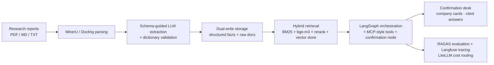
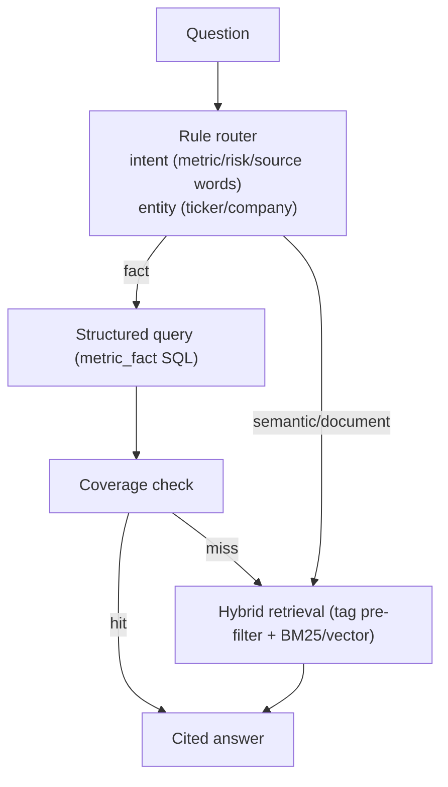

# Quantra Architecture

> Updated: 2026-08-11 ｜ Status: production-oriented, evolving with the codebase

## 0. System Overview

## 1. Parsing Layer (interface-driven pipeline)

`ParseRequest` (input contract: source, language, mode, tables, page range, engine)
→ engine layer (MinerU default in production, Docling, pdfplumber fallback)
→ `ParseResult` (output contract: blocks / markdown / stats / engine).

MinerU engine is integrated (`parsing/engines/mineru_engine.py` + `mineru_mapper.py`):
`magic-pdf` CLI produces `content_list.json` + `.md`, mapped into the unified `ParseResult`.
The mapper is version-tolerant with a markdown fallback, so the output contract never changes.

## 2. Extraction Layer (schema-guided LLM + rule validation)

`ParseResult → ExtractionResult`: company info, report metadata (broker/analyst/rating/target),
metric facts (value/period/unit/page/section), risks.

- Dictionary: 96 canonical metrics across 10 industries (general/banking/securities/insurance/
  real-estate/consumer/pharma/tech-manufacturing/auto/energy-chemicals/utilities-infra), alias-normalized.
- LLM channel (`extraction/llm_extractor.py`): schema-guided JSON extraction via OpenAI-compatible
  providers; dictionary validates and normalizes output (unknown metrics are rejected).
- Rule channel: deterministic extraction, used when no provider key is configured.

## 3. Storage Layer (dual-write)

| Table | Key | Purpose |
|---|---|---|
| `company` | company_id (**ticker-first**, e.g. `600036.SH`) | master dimension |
| `report` | report_id | report archive (broker/analyst/date/rating) |
| `metric_fact` | (report_id, company_id, metric_name, period) | metric facts (BI-ready) |
| `document_chunk` | chunk_id | text blocks for retrieval/citation |
| `risk` / `conclusion` | — | risks and key conclusions |
| `raw_doc` | doc_id | original-document registry (hash + composite tags) |
| `memory` | dedupe on (kind, entity, content) | cross-conversation memory |
| `extraction_audit` | — | audit trail |

Composite tags: ticker / company / industry / report_type / report_date / broker / source,
used for retrieval pre-filtering and BI grouping. Production raw-doc layer sits on multimodal /
object storage for provenance and full-text reading.

## 4. Query Routing (SQL-first / RAG-fallback)

- Rule router is the first gate: zero-model, explainable, auditable.
- Coverage check auto-falls-back to document retrieval; no model judgment needed.
- A lightweight judge node (production: cheap model) handles ambiguity; dev-mode rule stub.

## 5. Memory (confirmation-driven)

| Type | Content | Confidence | Entry |
|---|---|---|---|
| fact | trader-confirmed metric facts | 0.95 | confirmation action |
| conclusion | Q&A conclusions with sources | 0.90 | after each session |
| correction | trader corrections (e.g. "NIM in %") | 1.00 | correction action |
| preference | trader preferences | 0.80 | behavior stats (planned) |

`inject_memory` retrieves relevant memories by company/metric/tokens and injects them into the
current session. Production memory: LangGraph checkpoint + Mem0 / LangGraph Store.

## 6. Agent Orchestration

- Current: Plan-and-Execute loop with tool whitelist, cost-aware routing, audit hooks.
- Production: `agent/graph.py` wires a LangGraph state machine
  (planning → executing → reviewing → human confirmation) with the same tool set.

## 7. Providers (pluggable)

`providers/` exposes interfaces for LLM, embeddings (bge-m3 / OpenAI-compatible), vector store
(Qdrant / pgvector / in-memory), reranker (bge-reranker), and observability (Langfuse).
All degrade gracefully when optional dependencies are not installed.

## 8. Evolution

- Enable embeddings + vector store + rerank (interfaces ready)
- Enable LangGraph orchestration (graph module ready)
- RAGAS golden-regression suite
- Open-source contribution track
